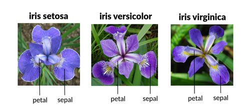
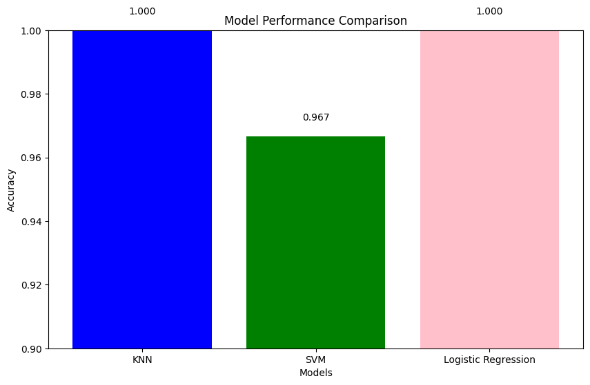
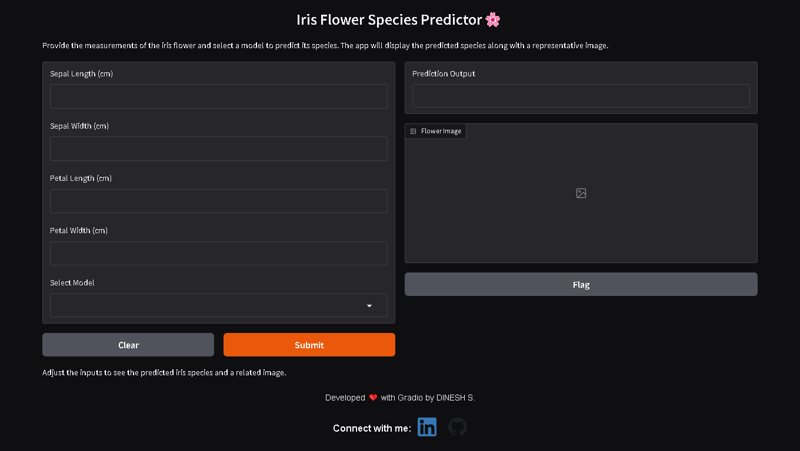
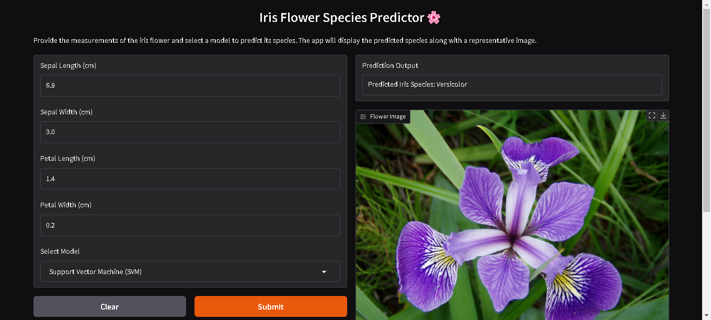

# Iris Flower Classification: A Comparison of KNN, SVM, and Logistic Regression



## **Try App:** [Link]()

## **Overview**
This project demonstrates the classification of the **Iris Flower dataset** using three different machine learning algorithms: **K-Nearest Neighbors (KNN)**, **Support Vector Machine (SVM)**, and **Logistic Regression**. The dataset contains measurements of four features (sepal length, sepal width, petal length, petal width) for three species of Iris flowers: **Setosa**, **Versicolor**, and **Virginica**. The goal of this project is to explore and compare the performance of these models on a classification task.

## **Dataset**
- **Name:** Iris dataset
- **Source:** [Scikit-learn](https://scikit-learn.org/)
- **Number of Samples:** 150
- **Features:** 
  - Sepal Length
  - Sepal Width
  - Petal Length
  - Petal Width
- **Target Classes:**
  - **Setosa**
  - **Versicolor**
  - **Virginica**

## **Project Goals**
- Compare the performance of **KNN**, **SVM**, and **Logistic Regression** models on the Iris dataset.
- Evaluate the models using classification metrics such as **accuracy**, **precision**, **recall**, and **F1-score**.
- Perform data preprocessing, including **standardization** to scale the features.

## **Model Comparison**
1. **K-Nearest Neighbors (KNN):** A non-parametric, instance-based learning algorithm that classifies a new sample based on the majority class of its nearest neighbors.
2. **Support Vector Machine (SVM):** A supervised machine learning model that constructs hyperplanes to classify data points.
3. **Logistic Regression:** A linear model used for binary and multiclass classification, applying the logistic function to predict class probabilities.

## **Project Structure**
```
Directory structure:
└── itzdineshx-iris-flower-classification/
    ├── README.md
    ├── LICENSE
    ├── requirements.txt
    ├── Data/
    │   ├── Iris.csv
    │   └── database.sqlite
    ├── img/
    │   └── flower_img/
    ├── models/
    │   ├── iris_knn_model.pkl
    │   ├── iris_logreg_model.pkl
    │   └── iris_svm_model.pkl
    ├── notebook/
    │   └── IRIS_FLOWERS_CLASSIFICATION.ipynb
    └── src/
        ├── app.py
        └── .gradio/
            └── certificate.pem

```

## **Installation**
Clone this repository to your local machine:

```bash
git clone https://github.com/your-username/Iris-Flower-Classification.git
cd Iris-Flower-Classification
```

Install the required dependencies:

```bash
pip install -r requirements.txt
```

## **Dependencies**
- **Scikit-learn:** A library for machine learning in Python.
- **Pandas:** Data manipulation and analysis library.
- **NumPy:** A library for numerical computations.
- **Matplotlib:** A plotting library for creating static, animated, and interactive visualizations.
- **Seaborn:** A data visualization library based on Matplotlib that provides a high-level interface for drawing attractive statistical graphics.

To install these libraries, run:

```bash
pip install scikit-learn pandas numpy matplotlib seaborn joblib gradio
```

## **Usage**
1. Open the Jupyter notebook `iris_classification.ipynb`.
2. Follow the steps in the notebook to load the dataset, perform data preprocessing, and train the models.
3. Evaluate the models using various classification metrics such as **accuracy**, **precision**, **recall**, and **F1-score**.
4. View the performance comparison between **KNN**, **SVM**, and **Logistic Regression**.

### **Loading the Pretrained Models**
You can also load the trained models directly from the `models/` folder, using the following code:

```python
import joblib

# Save the models and scaler
joblib.dump(knn, 'iris_knn_model.pkl')
joblib.dump(svm, 'iris_svm_model.pkl')
joblib.dump(logreg, 'iris_logreg_model.pkl')
joblib.dump(scaler, 'scaler.pkl')
```

You can then use these models to make predictions on new data, without the need to retrain them.

## **Results**
The models were evaluated on the Iris dataset with the following classification reports:

### **KNN Classification Report**
```
              precision    recall  f1-score   support
      setosa       1.00      1.00      1.00        10
  versicolor       1.00      1.00      1.00         9
   virginica       1.00      1.00      1.00        11

    accuracy                           1.00        30
   macro avg       1.00      1.00      1.00        30
weighted avg       1.00      1.00      1.00        30
```

### **SVM Classification Report**
```
              precision    recall  f1-score   support
      setosa       1.00      1.00      1.00        10
  versicolor       1.00      0.89      0.94         9
   virginica       0.92      1.00      0.96        11

    accuracy                           0.97        30
   macro avg       0.97      0.96      0.97        30
weighted avg       0.97      0.97      0.97        30
```

### **Logistic Regression Classification Report**
```
              precision    recall  f1-score   support
      setosa       1.00      1.00      1.00        10
  versicolor       1.00      1.00      1.00         9
   virginica       1.00      1.00      1.00        11

    accuracy                           1.00        30
   macro avg       1.00      1.00      1.00        30
weighted avg       1.00      1.00      1.00        30
```

## **Conclusion**
- **KNN** and **Logistic Regression** achieved perfect accuracy of 100%.
- **SVM** showed excellent performance with an accuracy of 97%, though its recall for the "Versicolor" class was slightly lower.
- All models performed well on the small and simple Iris dataset, but **KNN** and **Logistic Regression** were slightly better in this case.

## **Result**


Below is an example of a new section you can add to your README for demonstrating the interactive app, its usage, and how predictions are made:

---

## **App Demo: Interactive Use and Predictions**

This section details how to interact with the demo application built for Iris flower prediction.



## **Try App:** [Link]()

### **Demo Overview**
The interactive demo allows you to:
- Input numerical measurements for the iris flower features (sepal length, sepal width, petal length, petal width).
- Select the machine learning model (KNN, SVM, or Logistic Regression) via a dropdown.
- See the prediction result along with a representative flower image displayed from the `flower_img` folder.

### **How to Run the Demo**
1. **Install Dependencies:**  
   Ensure that all required libraries are installed by running:
   ```bash
   pip install -r requirements.txt
   ```

2. **Launch the App:**  
   From the project root or the `src` folder, launch the Gradio demo by executing:
   ```bash
   python app.py
   ```
   This command will start the Gradio interface and open a new tab in your default browser.

3. **Using the Demo Interface:**
   - **Input Values:** Enter values for the four features:
     - **Sepal Length (cm)**
     - **Sepal Width (cm)**
     - **Petal Length (cm)**
     - **Petal Width (cm)**
   - **Select a Model:** Use the dropdown to choose one of the available models:
     - **K-Nearest Neighbors (KNN)**
     - **Support Vector Machine (SVM)**
     - **Logistic Regression**
   - **Get Prediction:** Click the **"Predict"** button.
   
   After clicking **"Predict"**, the app will display:
   - A **text output** indicating the predicted Iris species.
   - An **image** of the corresponding iris flower loaded from the `flower_img` folder.

4. **Experiment and Explore:**  
   You can modify the inputs and select different models to see how each algorithm predicts the flower species. This interactive demo makes it easy to observe the decision behavior of each model.

> **Note:**  
> Ensure that the flower images (`setosa.jpg`, `versicolor.jpg`, and `virginica.jpg`) are correctly placed inside the `flower_img` folder so that the corresponding image appears upon prediction.



---

## 🤝 Contributing

Thank you for considering contributing to this project! We welcome all contributions, including:

- **Bug Fixes:** Identify and fix issues or improve error handling.
- **Feature Enhancements:** Add new models, metrics, or user-friendly features to improve the web app.
- **Performance Improvements:** Optimize the machine learning models for better accuracy and faster predictions.
- **UI/UX Enhancements:** Suggest or implement better designs for the Gradio interface.
- **Documentation:** Help improve project documentation, including instructions and explanations.
- **Test Cases:** Write and improve unit tests for model predictions and app functionality.

### 📥 How to Contribute
1. Fork the repository.
2. Clone your fork:
   ```bash
   git clone https://github.com/itzdineshx/Iris-flower-classification.git
   ```
3. Create a new branch:
   ```bash
   git checkout -b feature/new-feature
   ```
4. Make your changes and commit them:
   ```bash
   git commit -m "Add a new feature"
   ```
5. Push to your branch:
   ```bash
   git push origin feature/new-feature
   ```
6. Open a Pull Request explaining your changes.

### 📝 Contribution Guidelines
- Please ensure your code follows best practices and is well-documented.
- Before submitting a pull request, test your changes to ensure they work as expected.
- Include details about your changes and the problem they solve in the pull request.

---

## **Author**
DINESH S  
[my linkedin profile](https://www.linkedin.com/in/dinesh-x/) | [github link](https://github.com/itzdineshx/)

## **License**
This project is licensed under the MIT License - see the [LICENSE](LICENSE) file for details.
