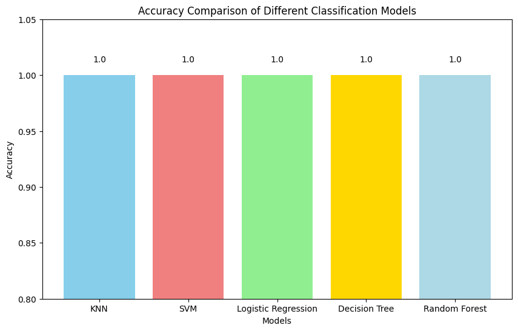
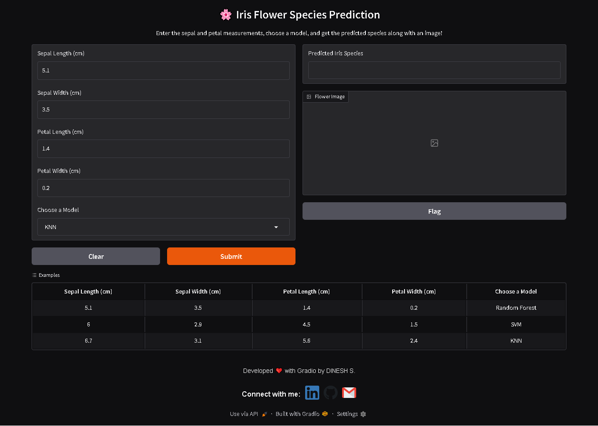
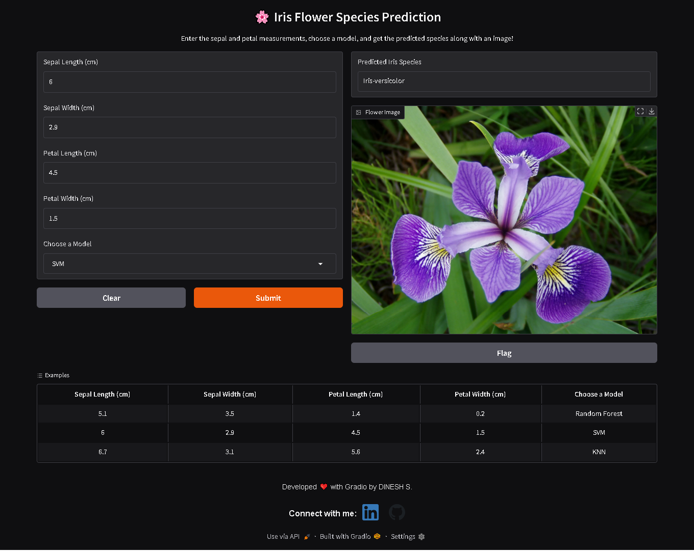

# Iris Flower Classification: A Comprehensive Comparison of Multiple Models with Confidence Prediction

 


*Watch the interactive demo in action!*

## **Try App:** [Link](https://huggingface.co/spaces/DINESH-X/Iris-Flower-classifier)

---

## **Overview**


This project demonstrates the classification of the **Iris Flower dataset** using five different machine learning algorithms:
- **K-Nearest Neighbors (KNN)**
- **Support Vector Machine (SVM)**
- **Logistic Regression**
- **Decision Tree**
- **Random Forest**

Each model predicts the species of an iris flower based on four measurements (sepal length, sepal width, petal length, petal width) and now also provides a confidence percentage with its prediction. The interactive Gradio app allows you to experiment with different inputs and see not only the predicted species but also a representative flower image.

---

## **Dataset**
- **Name:** Iris dataset
- **Source:** [Scikit-learn](https://scikit-learn.org/)
- **Number of Samples:** 150
- **Features:** 
  - Sepal Length (cm)
  - Sepal Width (cm)
  - Petal Length (cm)
  - Petal Width (cm)
- **Target Classes:**
  - **Iris-setosa**
  - **Iris-versicolor**
  - **Iris-virginica**

---

## **Project Goals**
- Compare the performance of **KNN**, **SVM**, **Logistic Regression**, **Decision Tree**, and **Random Forest** on the Iris dataset.
- Provide detailed prediction outputs with confidence percentages.
- Evaluate the models using metrics such as **accuracy**, **precision**, **recall**, and **F1-score**.
- Create an interactive demo with Gradio that displays predictions and corresponding flower images.
- Deploy the app for free using Hugging Face Spaces.

---

## **Model Comparison**
1. **K-Nearest Neighbors (KNN):**  
   Classifies based on the majority vote among nearest neighbors.
2. **Support Vector Machine (SVM):**  
   Constructs optimal hyperplanes (with probability estimates enabled) for class separation.
3. **Logistic Regression:**  
   Uses a logistic function to predict class probabilities.
4. **Decision Tree:**  
   Uses a tree-like model of decisions for classification.
5. **Random Forest:**  
   An ensemble method based on multiple decision trees for robust predictions.

  

---

## **Project Structure**

```
Directory structure:
└── itzdineshx-iris-flower-classification/
    ├── README.md
    ├── LICENSE
    ├── requirements.txt
    ├── Data/
    │   ├── Iris.csv
    │   └── database.sqlite
    ├── img/
    │   ├── iris_virginica.webp
    │   └── flower_img/
    ├── models/
    │   ├── iris_knn_model.pkl
    │   ├── iris_logreg_model.pkl
    │   ├── iris_svm_model.pkl
    │   └── iris_models_tuned/
    │       ├── dtc_model.joblib
    │       ├── knn_model.joblib
    │       ├── label_encoder.joblib
    │       ├── logreg_model.joblib
    │       ├── rfc_model.joblib
    │       ├── scaler.joblib
    │       └── svm_model.joblib
    ├── notebook/
    │   ├── IRIS_FLOWERS_CLASSIFICATION.ipynb
    │   └── IRIS_FLOWERS_CLASSIFICATION_2_0.ipynb
    └── src/
        ├── advanced_app.py
        ├── app.py
        └── .gradio/
            └── certificate.pem


```

---

## **Installation**

Clone this repository to your local machine:

```bash
git clone https://github.com/itzdineshx/Iris-Flower-Classification.git
cd Iris-Flower-Classification
```

Install the required dependencies:

```bash
pip install -r requirements.txt
```

---

## **Dependencies**

The project depends on the following libraries:
- **Scikit-learn:** For machine learning models.
- **Pandas:** For data manipulation.
- **NumPy:** For numerical operations.
- **Matplotlib & Seaborn:** For data visualization.
- **Joblib:** For model serialization.
- **Gradio:** For building the interactive web app.
- **Pillow:** For image processing.

To install these dependencies, run:

```bash
pip install scikit-learn pandas numpy matplotlib seaborn joblib gradio pillow
```

---

## **Usage**

### **Training and Saving Models**
The project includes a Jupyter Notebook (`IRIS_FLOWERS_CLASSIFICATION.ipynb`) and (`IRIS_FLOWERS_CLASSIFICATION_2.0.ipynb`) that demonstrates:
- Loading and preprocessing the Iris dataset.
- Visulization of Data
- Training the five classifiers.
- Evaluating the models using various classification metrics.
- Saving the trained models and scaler using Joblib.

Example code to save the models:
```python
import joblib

joblib.dump(knn, 'models/iris_knn_model.joblib')
joblib.dump(svm, 'models/iris_svm_model.joblib')
joblib.dump(logreg, 'models/iris_logreg_model.joblib')
joblib.dump(dtc, 'models/iris_dtc_model.joblib')
joblib.dump(rfc, 'models/iris_rfc_model.joblib')
joblib.dump(scaler, 'models/scaler.joblib')
joblib.dump(le, 'models/label_encoder.joblib')
```

### **Launching the App**
From the `src` folder, run the Gradio app with:
```bash
python app.py
```
This will start the Gradio interface, open a new browser tab, and display the interactive app.

---

## **App Demo: Interactive Predictions with Confidence**


  

The interactive demo allows you to:
- **Input Measurements:** Enter sepal and petal dimensions.
- **Select a Model:** Choose one of the five available classifiers.
- **View Predictions:** See the predicted Iris species along with a confidence percentage.
- **Display Image:** View a representative image of the predicted flower.

**Example Inputs:**
```python
examples=[
    [5.1, 3.5, 1.4, 0.2, "KNN"],              # Typical Iris-setosa
    [5.9, 3.0, 5.1, 1.8, "Logistic Regression"],  # Likely Iris-versicolor
    [6.3, 2.8, 5.1, 1.5, "SVM"],               # Typical Iris-virginica
    [6.7, 3.0, 5.2, 2.3, "Decision Tree"],     # Another Iris-virginica example
    [5.8, 2.7, 4.1, 1.0, "Random Forest"]      # Borderline case
]
```
These examples are available directly in the Gradio interface to help you get started.

  


---

## **Results**

The models have been evaluated on the Iris dataset using various metrics. Below are sample classification reports for each model. Note that the results may vary slightly depending on the train/test splits.

### **KNN Classification Report**

```
              precision    recall  f1-score   support
Iris-setosa       1.00      1.00      1.00        10
Iris-versicolor   1.00      1.00      1.00         9
Iris-virginica    1.00      1.00      1.00        11
```

---

### **SVM Classification Report**

```
              precision    recall  f1-score   support
Iris-setosa       1.00      1.00      1.00        10
Iris-versicolor   1.00      0.89      0.94         9
Iris-virginica    0.92      1.00      0.96        11
```

---

### **Logistic Regression Classification Report**

```
              precision    recall  f1-score   support
Iris-setosa       1.00      1.00      1.00        10
Iris-versicolor   1.00      1.00      1.00         9
Iris-virginica    1.00      1.00      1.00        11
```

---

### **Decision Tree and Random Forest Classification Report**

```
              precision    recall  f1-score   support
Iris-setosa       1.00      1.00      1.00        10
Iris-versicolor   1.00      1.00      1.00         9
Iris-virginica    1.00      1.00      1.00        11
```

---

## **Deployment**
The Gradio app has been deployed on Hugging Face Spaces for free hosting. You can access it here:
[https://huggingface.co/spaces/DINESH-X/Iris-Flower-classifier](https://huggingface.co/spaces/DINESH-X/Iris-Flower-classifier)

---

## **Contributing**
Contributions are welcome! If you have suggestions or improvements, please consider contributing:
- **Bug Fixes & Feature Enhancements**
- **Model Improvements & New Metrics**
- **UI/UX Enhancements**
- **Documentation & Examples**

### **How to Contribute**
1. Fork the repository.
2. Clone fork:
   ```bash
   git clone https://github.com/itzdineshx/Iris-flower-classification.git
   ```
3. Create a new branch:
   ```bash
   git checkout -b feature/new-feature
   ```
4. Commit changes:
   ```bash
   git commit -m "Add new feature"
   ```
5. Push to your branch:
   ```bash
   git push origin feature/new-feature
   ```
6. Open a Pull Request describing your changes.

---

## **Author**
**DINESH S**  
<h3>Connect with me:</h3>
<a href="https://www.linkedin.com/in/dinesh-x/" target="_blank">
  
</a>
<a href="https://github.com/itzdineshx/Iris-flower-classification" target="_blank">
  
</a>
<a href="mailto:personalaccdinesh@gmail.com" target="_blank">
  
</a>


---

## **License**
This project is licensed under the MIT License - see the [LICENSE](LICENSE) file for details.

---
